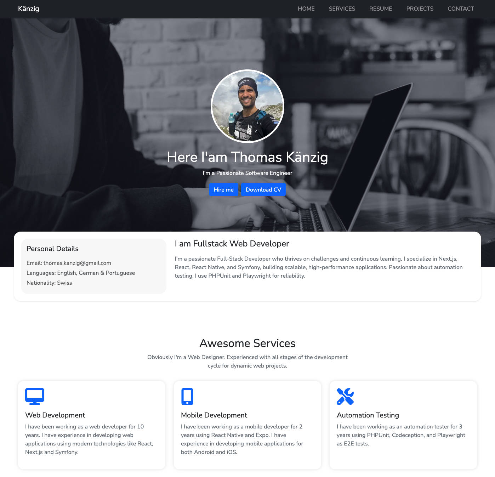

# Portfolio Next.js & Bootstrap CSS

This is a simple portfolio project using Next.js and Bootstrap CSS.



### Requirements
- [Docker Compose](https://docs.docker.com/compose/install/)

### Running applications:

Start the Docker containers:
```bash
docker-compose up -d
```

On this stage you should access already the application on the browser by the following URL: [http://localhost:3000](http://localhost:3000)

### Stop the Docker containers:
```bash
docker-compose down
```

### Execute npm commands into the node container:
```bash
docker exec -it node-container bash
```

#### It will open the bash terminal of the php container, and you can run any kind fo commands you want.
```bash
root@370c11910f26:/app# 
```

```bash
root@370c11910f26:/app# node -v
```

Output:

```bash
v22.9.0
```

To finish or exit the docker exec session, you can simply type exit in the terminal where the session is running.
```bash
root@370c11910f26:/app# exit
```


#### Check status of all containers:
```bash
docker ps
```

Or one specific container name:

```bash
docker ps --filter "name=node-container"
```


## Testing with Playwright

1. Run this command to go into the cypress container:
```bash
docker exec -it playwright-container bash
```

2. Initiate all tests with the following command:
```bash
root@9917128d5f2f:/app# npx playwright test
```

